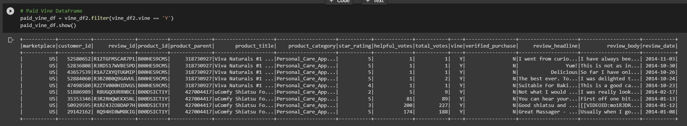
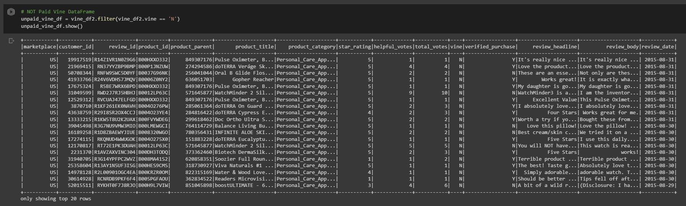
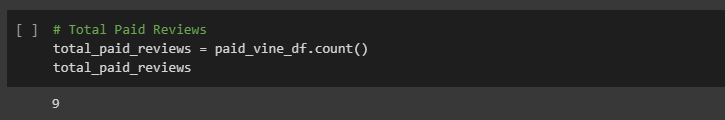
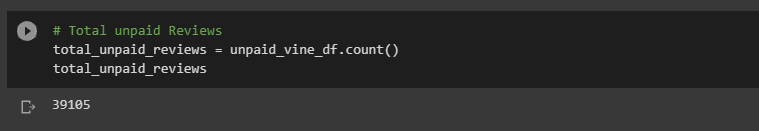
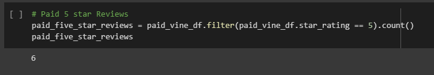
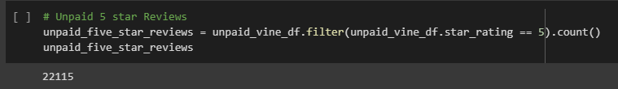
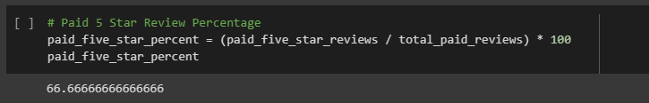
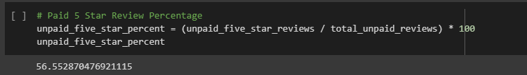

# Amazon Vine Analysis

## Overview of Analysis

Analyze Amazon reviews written by members of the paid Amazon Vine program. In this analysis, you will find if there are any bias towards favorable reviews from Vine members in the dataset chosen and displayed in the DataFrames below.

### DataFrames Created and Used

#### Paid Vine Reviews DataFrame

#### Unpaid Reviews DataFrame

## Results

### Total Number of Reviews

* Number of Vine Reviews

 

* Number of Non-Vine Reviews

### Total Number of 5-Star Reviews

* Number of 5 Star Vine Reviews

 

* Number of 5 Star Non-Vine Reviews

### Percentage of 5-Star Reviews

* Percentage of Vine Reviews - 5-Star Ratings

* Percentage of Non-Vine Reviews - 5-Star Ratings

## Summary

As shown above, 66.6% of the reviews in the Vine program were 5-star reviews, whereas 56.5% of non-Vine reviews were 5-star reviews. Although there is not a huge difference in the percentages in this dataset, it still shows there is some bias in the 5-star reviews. The vine reviews in this dataset were very low, 6-9 reviews shown against the almost 40,000 regular reviews, this may not paint a perfect picture about the bias towards reviews.

A further analysis that could be performed is pulling the lower starred reviews (1-2 stars) and find if those are also paid or unpaid to see a more complete picture of if there is more or less bias on the Vine reviews.
